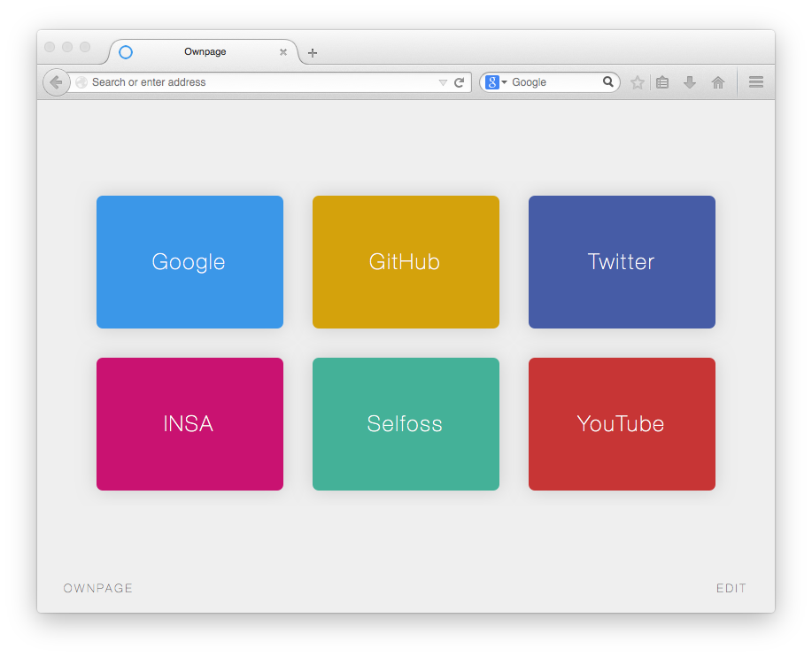

# Ownpage

Alternative to home page and new tab page of your browser.



#####Install:

```
$ git clone https://github.com/Ricain/ownpage
```
or [download zip](https://github.com/Ricain/ownpage/archive/master.zip).

Open `index.html` with your favorite browser and make it your homepage.

In order to use a custom page for new tabpage, use:

- Mozilla Firefox: [New Tab Homepage add-ons](https://addons.mozilla.org/en-US/firefox/addon/new-tab-homepage/)
- Google Chrome: [New Tab Redirect add-ons](https://chrome.google.com/webstore/detail/new-tab-redirect/icpgjfneehieebagbmdbhnlpiopdcmna)

#####Used scripts:

[Colpick](http://colpick.com) (GNU)

#####License:

[Creative Commons 2.5](http://creativecommons.org/licenses/by/2.5/)

- Free for use in both personal and commercial projects
- Attribution requires leaving author name, author link, and the license info intact
