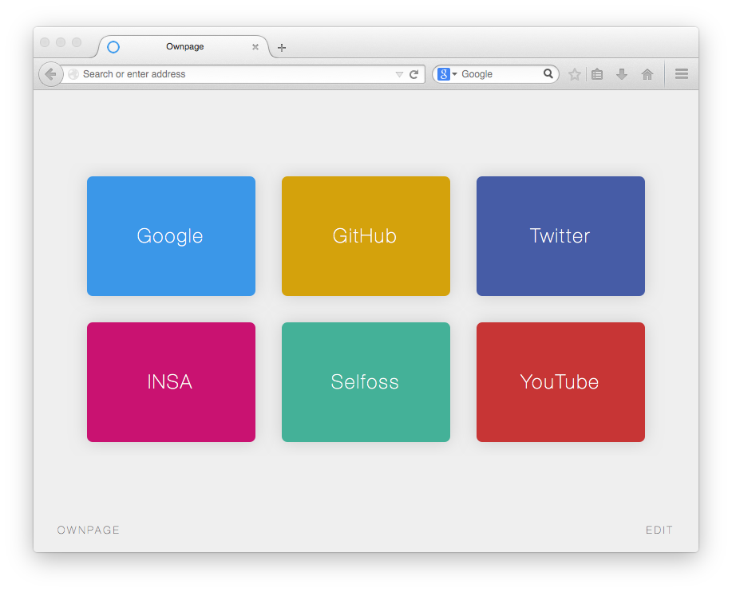

# Ownpage

*Your own homepage.*

Alternative home page and new tab page for your browser.

[DEMO - TRY IT - USE IT](http://ricain.github.io/ownpage/)



####Install

*Note: all your data are stored locally and are never sent to any server.*

###### Mozilla Firefox

[Install add-on](https://addons.mozilla.org/firefox/downloads/file/296834/ownpage-1.1-fx.xpi)

- [Add-on on Mozilla platform](https://addons.mozilla.org/en-US/firefox/addon/ownpage/)
- [Source code of add-on](https://github.com/Ricain/ownpage-firefox)

###### Google Chrome

[Install extension](http://goo.gl/hb6333)

- [Source code of extension](https://github.com/ricain/ownpage-chrome)

###### Safari & IE

For this two navigators you just have to go to your browser's settings where you can edit your home page and your new tab page.

#### Source

```
$ git clone -b gh-pages https://github.com/ricain/ownpage
```
or [download zip](https://github.com/Ricain/ownpage/archive/gh-pages.zip).

Open `index.html` with your favorite browser and make it your home page.

#### Roadmap

- [ ] drag and drop to reorgenize boxes in edit mode
- [ ] a way to export and import links and colors in json
- [ ] tutoriel for new user
- [ ] new favicon
- [ ] customizable background color and text color

#### Used scripts

[Colpick](http://colpick.com) (GNU GPL license)

#### License

[GNU GPL v3.0](https://github.com/ricain/ownpage/blob/gh-pages/LICENSE.md)
